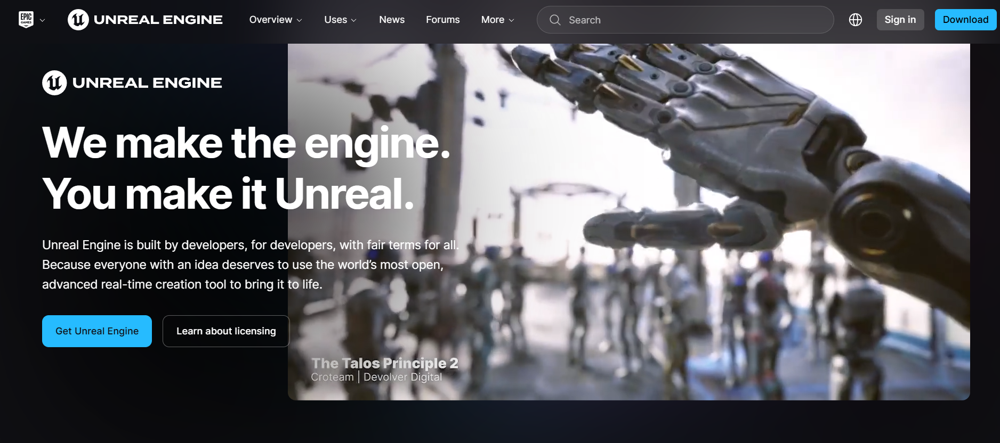

# Unreal Engine Clone 🌟

Welcome to my **Unreal Engine Clone** project!  
This is a frontend recreation of the Unreal Engine website, built with HTML, CSS, and JavaScript, designed for learning and demonstration purposes.

🔗 **Live Demo**: [Unreal Engine Clone](https://satyam-umrao.github.io/Unreal-Engine-Clone/)

## 📷 Preview

 

## 🚀 Features

- Responsive layout for all screen sizes
- Smooth scrolling navigation
- UI elements inspired by the official Unreal Engine site
- Clean and modular codebase

## 🛠️ Technologies Used

- HTML5
- CSS3
- JavaScript (Vanilla)

## 📁 Project Structure

Unreal-Engine-Clone/
├── index.html
├── css/
│ └── styles.css
├── js/
│ └── script.js
└── assets/
└── images, fonts, etc.

## 📌 Note

This is **not an official Unreal Engine website**. It’s a **clone for educational purposes only** and is in no way affiliated with Epic Games.

## 🧑‍💻 Author

**Satyam Umrao**  
- GitHub: [@satyam-umrao](https://github.com/satyam-umrao)

---

Feel free to clone, fork, and suggest improvements! ⭐
